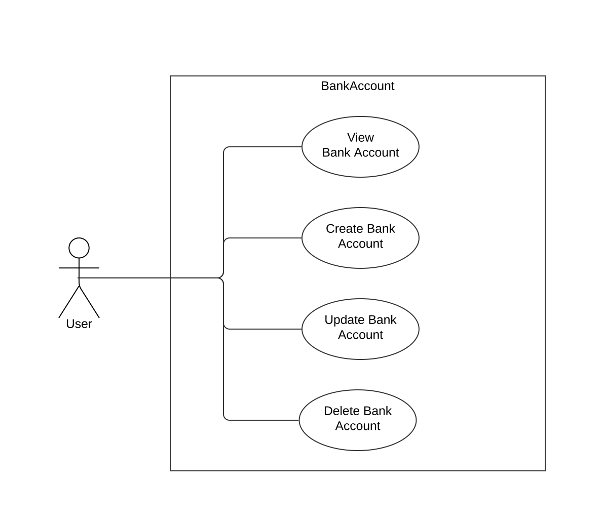

# Use Cases BankAccount [Lachenicht]



## View Bank Account

```
Title: View Bank Account

Primary Actors: User
Secondary Actors: -

Preconditions: -
Postconditions: The user receives information regarding the selected bank account.

Flow:
1. The user provides the ID of the bank account to view.
2. The system presents all information regarding the bank account with the given ID.


Alternative flows:
2a. No bank account with the provided ID exists: The system informs the user about his invalid input.

Information Requirements: ID
```

## Create Bank Account

```
Title: Create Bank Account

Primary Actors: User
Secondary Actors: -

Preconditions: -
Postconditions: A bank account with the given information exists in the set of bank accounts.

Flow:
1. The user enters the required information for a bank account.
2. The system validates the received information.
3. The system creates a new bank account.
4. The system adds the created bank account to the set of bank accounts.


Alternative flows:
3a. The received information is invalid: The system informs the user about his invalid input.

Information Requirements: ID, Name, Description, Balance, Disposition Limit, Labels
```

## Update Bank Account

```
Title: Update Bank Account

Primary Actors: User
Secondary Actors: -

Preconditions: The bank account to update exists in the set of bank accounts.
Postconditions: The information of the existing bank account is updated.

Flow:
1. The user provides the ID of the bank account to update.
2. The system retrieves the bank account with the given ID.
3. The user enters the updated information for a bank account.
4. The system validates the received data and updates the existing bank account.


Alternative flows:
2a. No bank account with the provided ID exists: The system informs the user about his invalid input.
4a. The received information is invalid: The system informs the user about his invalid input.

Information Requirements: ID, Name, Description, Balance, Disposition Limit, Labels
```

## Delete Bank Account

```
Title: Delete Bank Account

Primary Actors: User
Secondary Actors: -

Preconditions: The bank account to delete exists in the set of bank accounts.
Postconditions: The bank account with the given ID does not exist in the set of bank accounts.

Flow:
1. The user provides the ID of the bank account to delete.
2. The systems removes the bank account with the given ID from the set of bank accounts.


Alternative flows:
2a. No bank account with the provided ID exists: The system informs the user about his invalid input.

Information Requirements: ID
```
