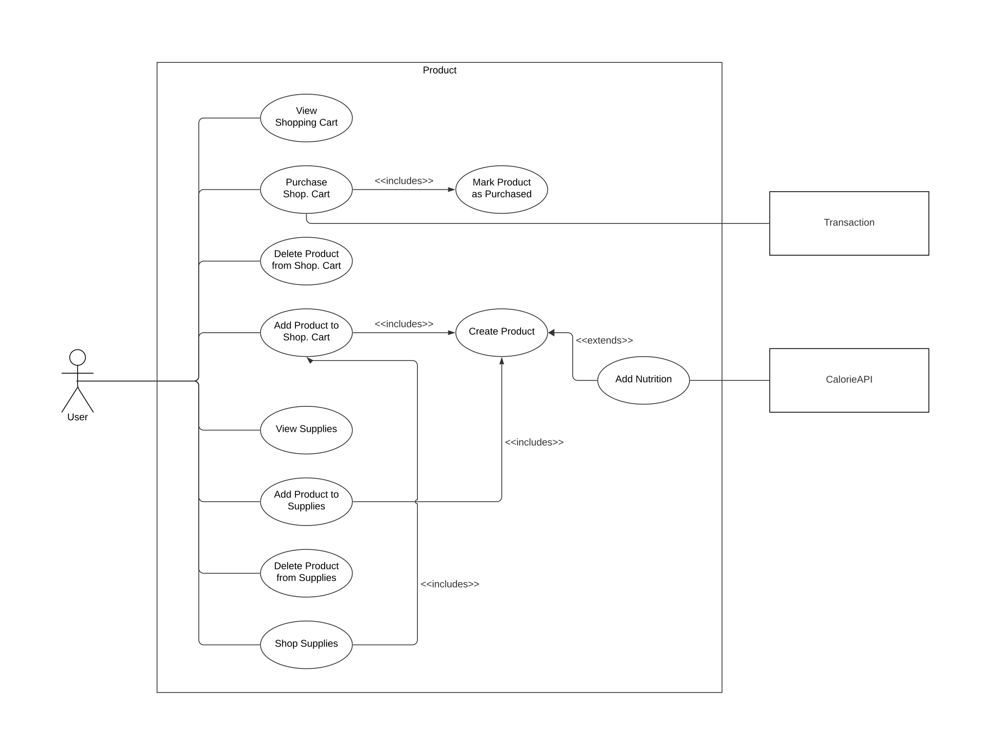

# Use Cases Product [Lachenicht]




## Create Product

```
Title: Create Product

Primary Actors: User
Secondary Actors: -

Preconditions: -
Postconditions: A prouct with the given information exists in the set of products.

Flow:
1. The user enters the required information for a product.
2. The system validates the received information.
3. The system creates a new product.
4. The system adds the created product to the set of product.


Alternative flows:
3a. The received information is invalid: The system informs the user about his invalid input.
4a. The product belongs to category Food or Drink:  The system triggers use case 'Add Nutrition'. Then, the system adds the created product to the set of product.

Information Requirements: ID, Name, Description, Size, Price, Category, Labels.
```

## Add Nutrition

```
Title: Add Nutrition

Primary Actors: -
Secondary Actors: CalorieAPI

Preconditions: A product with category Food or Dink is being created.
Postconditions: The product is enriched with nutritional values.

Flow:
1. The system provides the CalorieAPI with the name of the product being created.
2. The CalorieAPI responds with the nutritional values for this product.
3. The system enriches the product with the nutritional values.


Alternative flows:
2a. The CalorieAPI could not determine nutritional values: The system does not add nutritional values to the product.

Information Requirements: Name
```

## View Shopping Cart/View Supplies

```
Title: View Shopping Cart/View Supplies

Primary Actors: User
Secondary Actors: -

Preconditions: -
Postconditions: The user receives information regarding the shopping cart/supplies.

Flow:
1. The user selects the shopping cart/supplies.
2. The system presents all information regarding the shopping cart/supplies.


Alternative flows: -

Information Requirements: -
```

## Add Product to Shopping Cart/Supplies

```
Title: Add Product to Shopping Cart/Supplies

Primary Actors: User
Secondary Actors: -

Preconditions: The user has created the product to add to the shopping cart/supplies.
Postconditions: The created product exists in the shopping cart/supplies.

Flow:
1. The user selects the shopping cart/supplies.
2. The user provides the ID of the product to add to the shopping cart/supplies.
3. The system adds the product to the shopping cart/supplies.


Alternative flows:
3a. No product with the provided ID exists: The system informs the user about his invalid input.

Information Requirements: ID
```

## Delete Product From Shopping Cart/Supplies

```
Title: Delete Product From Shopping Cart/Supplies

Primary Actors: User
Secondary Actors: -

Preconditions: The product to delete exists in the shopping cart/supplies.
Postconditions: The product with the given ID does not exist in the shopping cart/supplies.

Flow:
1. The user selects the shopping cart/supplies.
2. The user provides the ID of the product to delete.
3. The system removes the product from the shopping cart/supplies.


Alternative flows:
3a. No product with the provided ID exists: The system informs the user about his invalid input.

Information Requirements: ID
```

## Purchase Shopping Cart

```
Title: Purchase Shopping Cart

Primary Actors: User
Secondary Actors: -

Preconditions: The product to delete exists in the shopping cart/supplies.
Postconditions: The product with the given ID does not exist in the shopping cart/supplies.

Flow:
1. The user selects the shopping cart/supplies.
2. The user provides the ID of the product to delete.
3. The system removes the product from the shopping cart/supplies.


Alternative flows:
3a. No product with the provided ID exists: The system informs the user about his invalid input.

Information Requirements: ID
```
