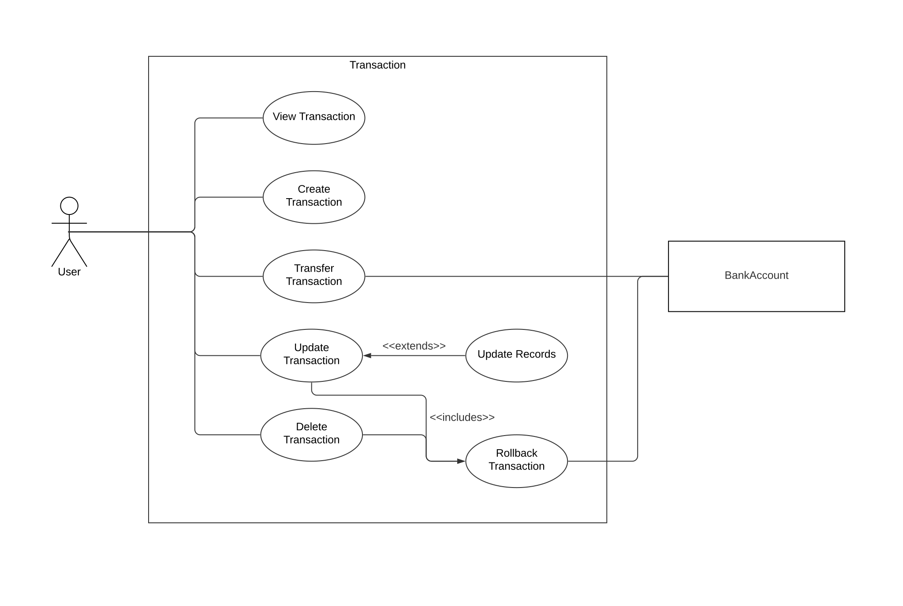

# Use Cases Transaction [Lachenicht]



## View Transaction

```
Title: View Transaction

Primary Actors: User
Secondary Actors: -

Preconditions: -
Postconditions: The user receives information regarding the selected transaction.

Flow:
1. The user provides the ID of the transaction to view.
2. The system presents all information regarding the transaction with the given ID.


Alternative flows:
2a. No transaction with the provided ID exists: The system informs the user about his invalid input.

Information Requirements: ID
```

## Create Transaction

```
Title: Create Transaction

Primary Actors: User
Secondary Actors: -

Preconditions: -
Postconditions: A transaction with the given information exists in the set of transactions.

Flow:
1. The user enters the required information for a transaction.
2. The system validates the received information.
3. The system creates a new transaction.
4. The systems adds the created transacton to the set of transactions.


Alternative flows:
3a. The received information is invalid: The system informs the user about his invalid input.

Information Requirements: 
- One-Time Transaction: ID, Name, Description, Type, Transfer, Date, Amount, Labels.
- Recurring Transaction: ID, Name, Description, Type, Transfer, StartDate, Periodicity, FixedAmount, Labels.
```

## Update Transaction

```
Title: Update Transaction

Primary Actors: User
Secondary Actors: -

Preconditions: The transacton to update exists in the set of transactions.
Postconditions: The information of the existing transaction is updated.

Flow:
1. The user provides the ID of the transaction to update.
2. The system retrieves the transaction with the given ID.
3. The user enters the updated information for the transaction.
4. The system validates the received data and updates the existing transaction.


Alternative flows:
2a. No transaction with the provided ID exists: The system informs the user about his invalid input.
4a. The transaction is successfully transferred: The system triggers use case RollbackTransaction. Then the transaction is updated.

Information Requirements: 
- One-Time Transaction: Name, Description, Type, Transfer, Date, Amount, Labels.
- Recurring Transaction: Name, Description, Type, Transfer, StartDate, Periodicity, FixedAmount, Labels.
```


## Update Records

```
Title: Create Transaction

Primary Actors: User
Secondary Actors: -

Preconditions: The recurring transacton for which records should be updated exists in the set of transactions.
Postconditions: The records of the recurring transaction are updated.

Flow:
1. The user provides the ID of the recurring transaction for which records should be updated.
2. The system retrieves the transaction with the given ID.
3. The user updates the records for the transaction.
4. The system validates the received information and updates the records of the recurring transaction.


Alternative flows:
2a. No transaction with the provided ID exists or existing transaction is not recurring: The system informs the user about his invalid input.
4a. The received information is invalid: The system informs the user about his invalid input.

Information Requirements: ID, Date, Amount
```

## Delete Transaction

```
Title: Delete Transaction

Primary Actors: User
Secondary Actors: -

Preconditions: The transaction to delete exists in the set of transactions.
Postconditions: The transaction with the given ID does not exist in the set of transactions and is successfully rolled back.

Flow:
1. The user provides the ID of the transaction to delete.
2. The system retrieves the transaction with the given ID.
3. The system removes the transaction with the given ID from the set of transactions.


Alternative flows:
2a. No transaction with the provided ID exists: The system informs the user about his invalid input.
3a. The transaction is successfully transferred: The system triggers use case RollbackTransaction. Then the transaction is removed.

Information Requirements: ID
```

## Transfer Transaction

```
Title: Transfer Transaction

Primary Actors: User
Secondary Actors: BankAccount

Preconditions: The transaction to transfer exists in the set of transactions.
Postconditions: The transaction is transferred and the corresponding bank accounts are updated.

Flow:
1. The user provides the ID of the transaction to transfer.
2. The system retrieves the transaction with the given ID.
3. The system retrieves the involved bank accounts.
4. The system validates, that the bank account to deposit from has enough balance.
5. The system updates the involved bank accounts.
6a. One-Time Transaction: The system sets the transfer status of the transaction to successful.
6b. Recurring Transaction: The system creates a new transaction record and sets the status of the record to successful.


Alternative flows:
2a. No transaction with the provided ID exists: The system informs the user about his invalid input.
3a. One or both bank accounts involved in the transfer do not exist: The system informs the user about the failure and sets the transfer status to failed.
4a. The source bank accounts does not have enough balance: The system informs the user about the failure and sets the transfer status to failed.

Information Requirements: ID
```

## Rollback Transaction

```
Title: Rollback Transaction

Primary Actors: -
Secondary Actors: BankAccount

Preconditions: The transaction to rollback exists in the set of transactions and is successfully transferred.
Postconditions: The transaction is rolled back and the corresponding bank accounts are updated.

Flow:
1. The system retrieves the involved bank accounts.
2. The system transfers the originally transferred amount back to the source bank account and deducts it from the target bank account.


Alternative flows:
1a. One or both bank accounts involved in the transfer do not exist: The system informs the user about the failure and aborts the transaction update/deletion.

Information Requirements: Transfer
```
