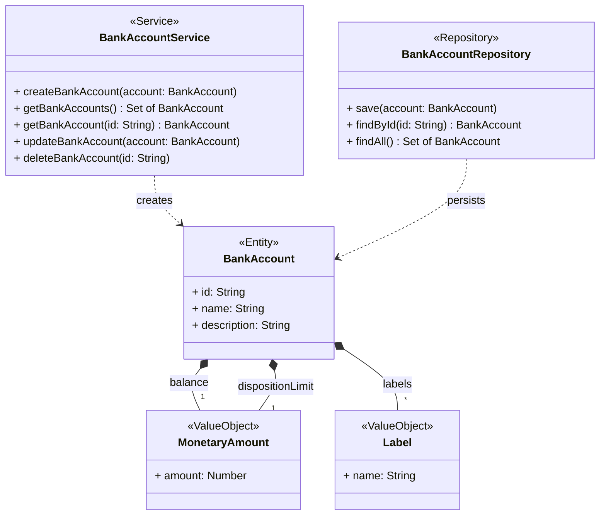

# Domain BankAccount [Lachenicht]

```mermaid

classDiagram

    BankAccount  *-- "1" MonetaryAmount : balance
    BankAccount  *-- "1" MonetaryAmount : dispositionLimit
    BankAccount  *-- "*" Label : labels

    BankAccountService ..> BankAccount : creates

    BankAccountRepository ..> BankAccount : persists

    class BankAccount {
        <<Entity>>
        + id: String
        + name: String
        + description: String
    }

    class MonetaryAmount {
        <<ValueObject>>
        + amount: Number
    }

    class Label {
        <<ValueObject>>
        + name: String
    }

    class BankAccountService {
        <<Service>>
        + createBankAccount(account: BankAccount)
        + getBankAccounts() Set of BankAccount
        + getBankAccount(id: String) BankAccount
        + updateBankAccount(account: BankAccount)
        + deleteBankAccount(id: String)
    }

    class BankAccountRepository {
        <<Repository>>
        + save(account: BankAccount)
        + findById(id: String) BankAccount
        + findAll() Set of BankAccount
    }


```