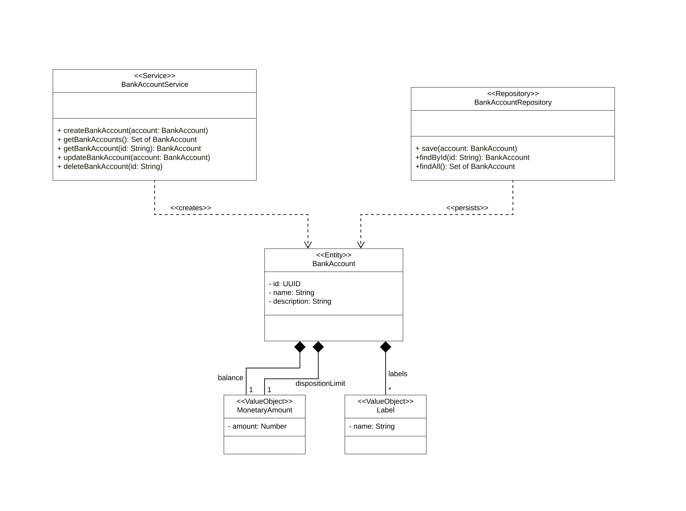

# Domain BankAccount [Lachenicht]

## Domain Description

The central entity of this domain is the **bank account**. A bank account has a unique **identifier**, as well as a **name** for natural language identification and a **description** to add explanatory information.
A bank account has a **balance**, which corresponds to the money currently deposited in it.
Additionally, a bank account has a **disposition limit**, indicating how far the account may be overdrawn.
A bank account can also be **labeled**, allowing bank accounts to be grouped.

The lifecycle of a bank account is managed by the **BankAccountService**, which executes **CRUD** operations on bank accounts.
The **persistence** of bank accounts is handled by the **BankAccountRepository**.
