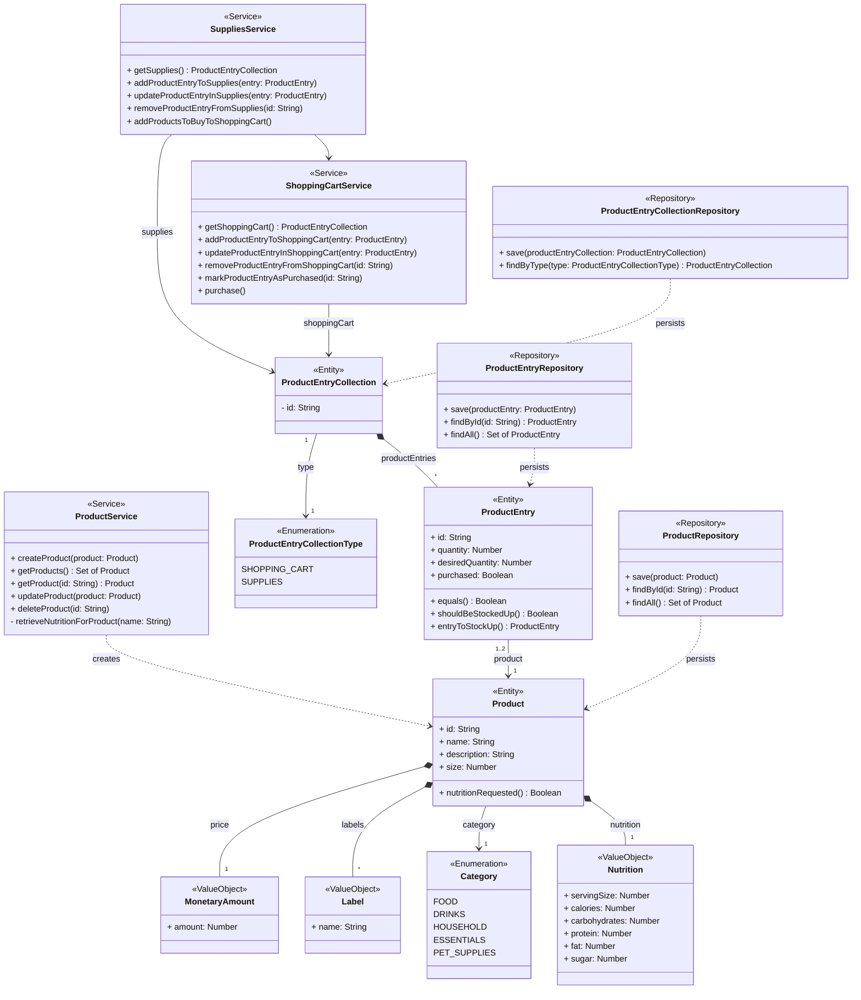

# Domain Product [Lachenicht]

```mermaid

classDiagram

    SuppliesService --> ProductEntryCollection : supplies
    SuppliesService --> ShoppingCartService
    ShoppingCartService --> ProductEntryCollection : shoppingCart
    ProductService ..> Product : creates

    ProductEntryCollection "1" --> "1" ProductEntryCollectionType : type
    ProductEntryCollection *-- "*" ProductEntry : productEntries

    ProductEntry "1..2" --> "1" Product : product  

    Product  *-- "1" MonetaryAmount : price
    Product  *-- "*" Label : labels
    Product  --> "1" Category : category
    Product  *-- "1" Nutrition : nutrition

    ProductRepository ..> Product : persists
    ProductEntryRepository ..> ProductEntry : persists
    ProductEntryCollectionRepository ..> ProductEntryCollection : persists

    class SuppliesService {
        <<Service>>
        + getSupplies() ProductEntryCollection
        + addProductEntryToSupplies(entry: ProductEntry)
        + updateProductEntryInSupplies(entry: ProductEntry)
        + removeProductEntryFromSupplies(id: String)
        + addProductsToBuyToShoppingCart()
    }

    class ShoppingCartService {
        <<Service>>
        + getShoppingCart() ProductEntryCollection
        + addProductEntryToShoppingCart(entry: ProductEntry)
        + updateProductEntryInShoppingCart(entry: ProductEntry)
        + removeProductEntryFromShoppingCart(id: String)
        + markProductEntryAsPurchased(id: String)
        + purchase()
    }

    class ProductService {
        <<Service>>
        + createProduct(product: Product)
        + getProducts() Set of Product
        + getProduct(id: String) Product
        + updateProduct(product: Product)
        + deleteProduct(id: String)
        - retrieveNutritionForProduct(name: String)
    }

    class ProductRepository {
        <<Repository>>
        + save(product: Product)
        + findById(id: String) Product
        + findAll() Set of Product
    }

    class ProductEntryRepository {
        <<Repository>>
        + save(productEntry: ProductEntry)
        + findById(id: String) ProductEntry
        + findAll() Set of ProductEntry
    }

    class ProductEntryCollection {
        <<Entity>>
        - id: String
    }

    class ProductEntryCollectionRepository {
        <<Repository>>
        + save(productEntryCollection: ProductEntryCollection)
        + findByType(type: ProductEntryCollectionType) ProductEntryCollection
    }

    class ProductEntry {
        <<Entity>>
        + id: String
        + quantity: Number
        + desiredQuantity: Number
        + purchased: Boolean
        + equals() Boolean
        + shouldBeStockedUp() Boolean
        + entryToStockUp() ProductEntry
    }

    class Product {
        <<Entity>>
        + id: String
        + name: String
        + description: String
        + size: Number
        + nutritionRequested() Boolean
    }

    class MonetaryAmount {
        <<ValueObject>>
        + amount: Number
    }

    class Label {
        <<ValueObject>>
        + name: String
    }

    class Category {
        <<Enumeration>>
        FOOD
        DRINKS
        HOUSEHOLD
        ESSENTIALS
        PET_SUPPLIES
    }

    class ProductEntryCollectionType {
        <<Enumeration>>
        SHOPPING_CART
        SUPPLIES
    }

    class Nutrition {
        <<ValueObject>>
        + servingSize: Number
        + calories: Number
        + carbohydrates: Number
        + protein: Number
        + fat: Number
        + sugar: Number
    }

```