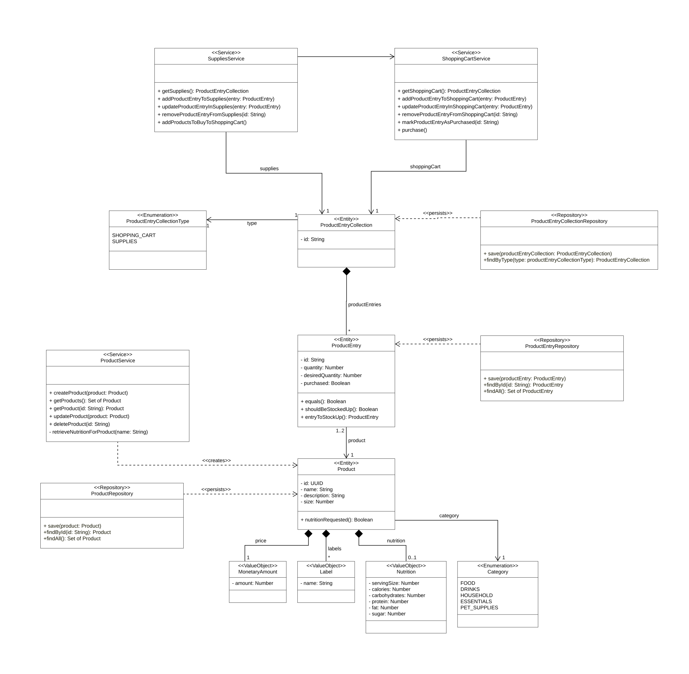

# Domain Product [Lachenicht]

## Domain Description

The central entity of this domain is the **product**.
A product has a unique **identifier**, as well as a **name** for natural language identification and a **description** to add explanatory information.
A product consists of a **size**, indicating how much of the product constitutes one unit. For example, for a carton of milk, the size could be 1000g (1L).
A product belongs to a **category**. Possible categories include **food**, **drinks**, **household**, **essentials**, and **pet supplies**.
These are the central product categories of [Rewe Delivery](https://shop.rewe.de/?serviceTypes=delivery).
Products in the food and drinks categories additionally contain information about **nutritional values** such as **calories**, **carbohydrates**, **protein**, **sugar**, and **fats**.
These nutritional values are provided in relation to the **serving size** (default 100g).
Products also have a **price** and can be grouped by **labels**.

The lifecycle of a product is managed by the **ProductService**, which executes **CRUD** operations on products.
Furthermore, the service includes functionalities for **determining nutritional values** for products using an external system.
The **persistence** of products is handled by the **ProductRepository**.

Products can be part of a **ProductEntryCollection**. Such a collection can be the collection of products currently in stock at home (**supplies**) or the collection of products that should be shopped (**shopping cart**).
Supplies and shopping carts comprise **product entries** that **reference a product**. Additionally, these entries define the **quantity** of the referenced product that is currently in stock or should be shopped.

The services **ShoppingCartService** and **SuppliesService** manage the two product entry collections. Both services involve **CRUD** operations. In addition to CRUD operations, **ShoppingCartService** includes functionality to **mark product entries as purchased** and to **debit the summed price** of all marked products from a selected bank account. **SuppliesService** includes functionality to **add products that are needed to the shopping cart**.

The **persistence** of product entries, shopping cart, and supplies is handled by the **ProductEntryRepository** and the **ProductEntryCollectionRepository**.