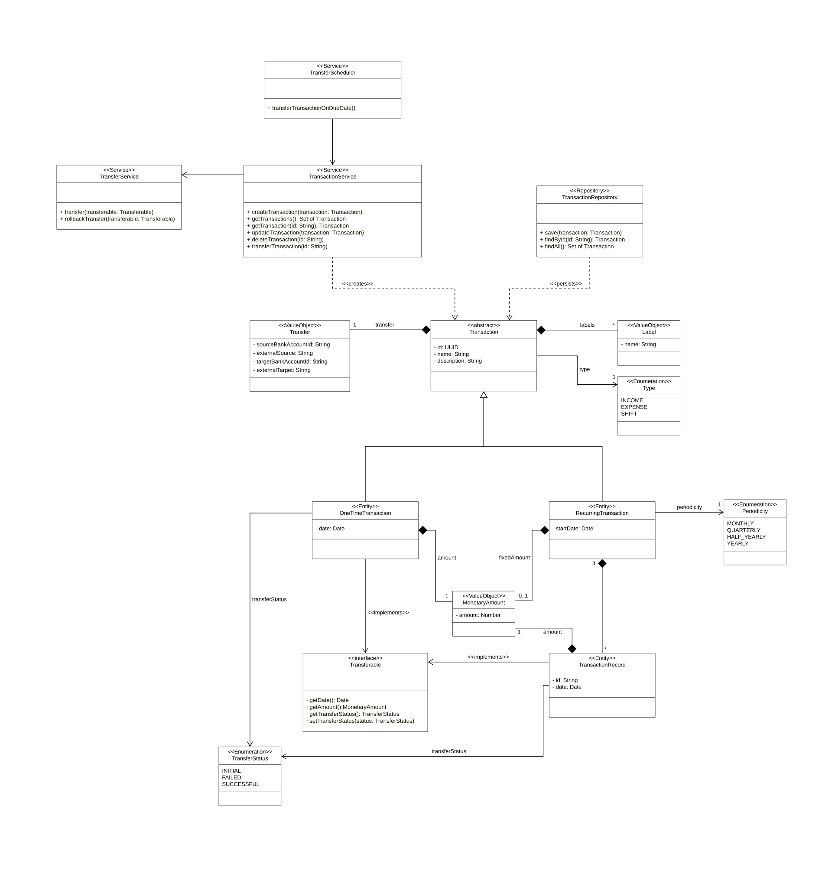

# Domain Transaction [Lachenicht]

The central entity of this domain is the **transaction**.
A transaction has a unique **identifier**, as well as a **name** for natural language identification and a **description** to add explanatory information.
Transactionscan be grouped by **labels**.
A transaction takes place either from an external source to a bank account (**income**), from a bank account to an external target (**expense**) or internally between two bank accounts (**shift**).

A transaction can be a **one-one transaction** or a **recurring transaction**.
A one-time transaction defines a **date** on which a certain **amount** is transferred.
A one-time transaction also has a **status** that indicates whether it has been successfully transferred.

A recurring transaction is transferred **periodically**, for example every month, every quarter, every half year, or every year.
A recurring transaction defines the **start date** starting from which periodic transfers are to be made.
A recurring transaction also defines whether a **fixed amount** is to be transferred or whether the amount to be transferred is variable.
When a recurring transaction is transferred, a **transaction record** is created for each execution, which defines a **date** on which a certain **amount** is to be transferered and has a **status**, analogous to the one-time transaction.

The lifecycle of a transaction is managed by the **TransactionService**, which executes **CRUD** operations on transactions.
The **TransferService** is responsible for transferring one-time transactions and transaction records.
The **TransferScheduler** transfers recurring transactions on a recurring basis according to their start date and periodicity.
The **persistence** of transactions is handled by the **TransactionRepository**.

