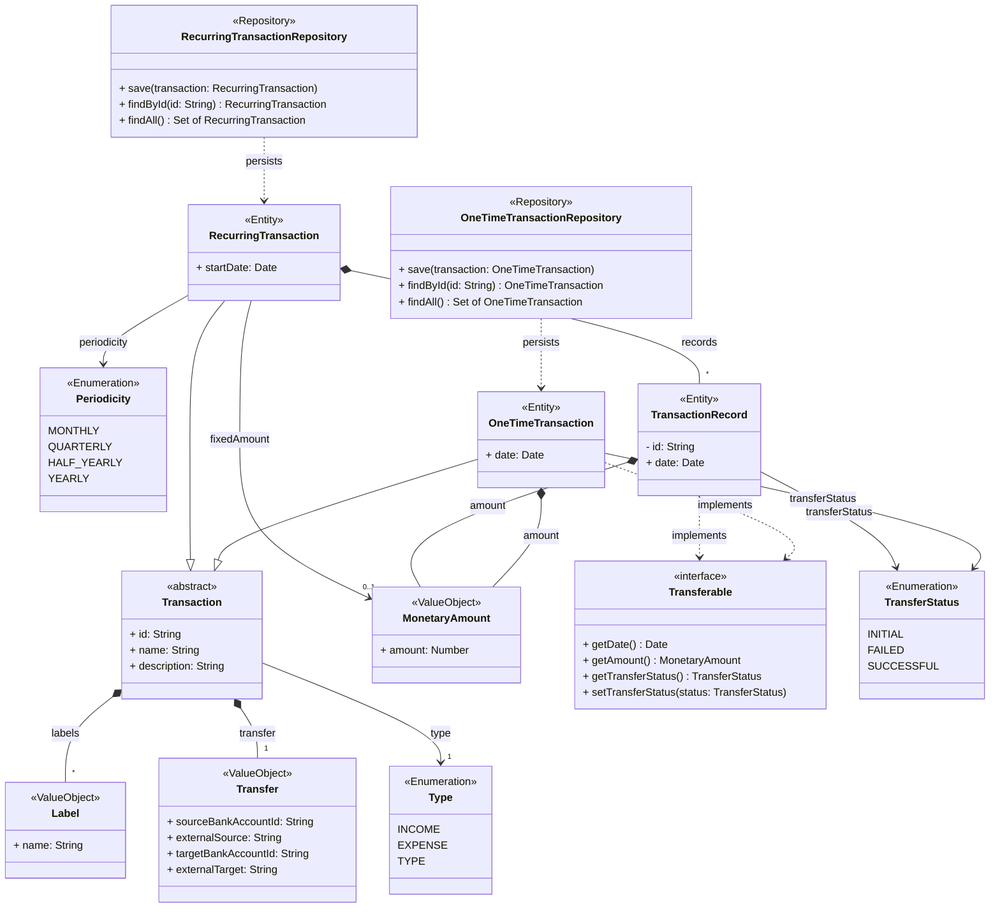

# Domain Transaction [Lachenicht]

```mermaid

classDiagram

    Transaction  *-- "*" Label : labels
    Transaction  *-- "1" Transfer : transfer
    Transaction  --> "1" Type : type

    RecurringTransaction  --|> Transaction
    RecurringTransaction  --> Periodicity : periodicity
    RecurringTransaction  --> "0..1" MonetaryAmount : fixedAmount
    RecurringTransaction  *-- "*" TransactionRecord : records

    TransactionRecord  ..> Transferable : implements
    TransactionRecord  *-- MonetaryAmount : amount
    TransactionRecord  --> TransferStatus : transferStatus

    OneTimeTransaction  --|> Transaction
    OneTimeTransaction  *-- MonetaryAmount : amount
    OneTimeTransaction  --> TransferStatus : transferStatus
    OneTimeTransaction  ..> Transferable : implements

    OneTimeTransactionRepository ..> OneTimeTransaction : persists
    RecurringTransactionRepository ..> RecurringTransaction : persists

    class OneTimeTransactionRepository {
        <<Repository>>
        + save(transaction: OneTimeTransaction)
        + findById(id: String) OneTimeTransaction
        + findAll() Set of OneTimeTransaction
    }

    class RecurringTransactionRepository {
        <<Repository>>
        + save(transaction: RecurringTransaction)
        + findById(id: String) RecurringTransaction
        + findAll() Set of RecurringTransaction
    }

    class Transferable {
        <<interface>>
        + getDate() Date
        + getAmount() MonetaryAmount
        + getTransferStatus() TransferStatus
        + setTransferStatus(status: TransferStatus)
    }

    class Transaction {
        <<abstract>>
        + id: String
        + name: String
        + description: String
    }

    class RecurringTransaction {
        <<Entity>>
        + startDate: Date
    }

    class OneTimeTransaction {
        <<Entity>>
        + date: Date
    }

    class TransactionRecord {
        <<Entity>>
        - id: String
        + date: Date
    }

    class MonetaryAmount {
        <<ValueObject>>
        + amount: Number
    }

    class Label {
        <<ValueObject>>
        + name: String
    }

    class Type {
        <<Enumeration>>
        INCOME
        EXPENSE
        TYPE
    }

    class Transfer {
        <<ValueObject>>
        + sourceBankAccountId: String
        + externalSource: String
        + targetBankAccountId: String
        + externalTarget: String
    }

    class TransferStatus {
        <<Enumeration>>
        INITIAL
        FAILED
        SUCCESSFUL
    }

    class Periodicity {
        <<Enumeration>>
        MONTHLY
        QUARTERLY
        HALF_YEARLY
        YEARLY
    }

```