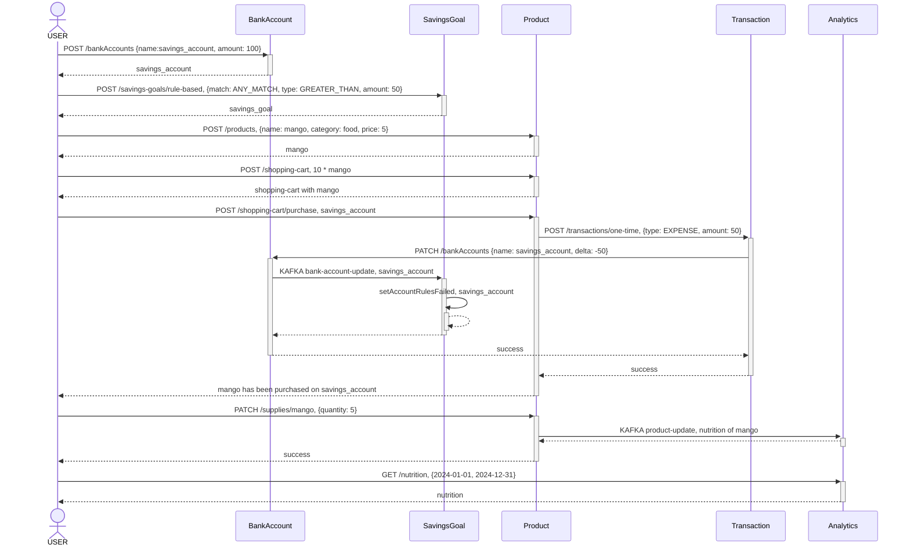

# Mainline Scenario [Lachenicht, Kässmann]

```mermaid

sequenceDiagram

    actor USER

    USER->>+BankAccount: POST /bankAccounts {name:savings_account, amount: 100}

    BankAccount-->>-USER: savings_account

    USER->>+SavingsGoal: POST /savings-goals/rule-based, {match: ANY_MATCH, type: GREATER_THAN, amount: 50}

    SavingsGoal-->>-USER: savings_goal

    USER->>+Product: POST /products, {name: mango, category: food, price: 5}

    Product-->>-USER: mango

    USER->>+Product: POST /shopping-cart, 10 * mango

    Product-->>-USER: shopping-cart with mango

    USER->>+Product: POST /shopping-cart/purchase, savings_account

    Product->>+Transaction: POST /transactions/one-time, {type: EXPENSE, amount: 50}

    Transaction->>+BankAccount: PATCH /bankAccounts {name: savings_account, delta: -50}

    BankAccount->>+SavingsGoal: KAFKA bank-account-update, savings_account

    SavingsGoal->>+SavingsGoal: setAccountRulesFailed, savings_account
    SavingsGoal-->>-SavingsGoal: 

    SavingsGoal-->>-BankAccount: 

    BankAccount-->>-Transaction: success

    Transaction-->>-Product: success

    Product-->>-USER: mango has been purchased on savings_account

    USER->>+Product: PATCH /supplies/mango, {quantity: 5}

    Product->>+Analytics: KAFKA product-update, nutrition of mango

    Analytics-->>-Product:  

    Product-->>-USER: success

    USER->>+Analytics: GET /nutrition, {2024-01-01, 2024-12-31}

    Analytics-->>-USER: nutrition
```
