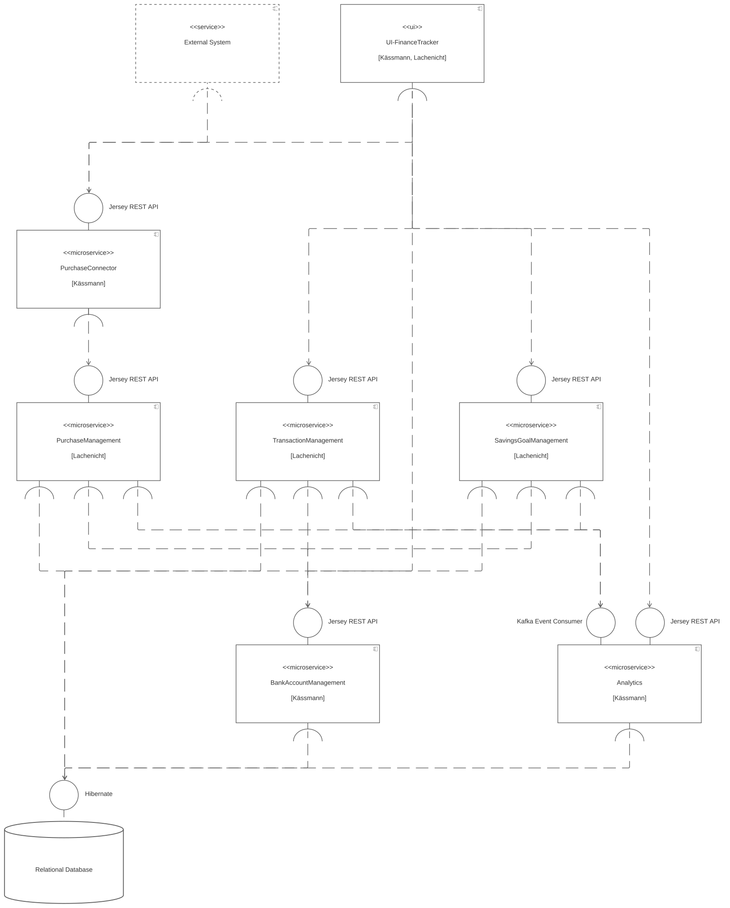

# Software Architecture [Lachenicht]

**<\<ui\>> UI-FinanceTracker**
Uses the Jersey REST API offered by `PurchaseConnector`, `TransactionManagement`, `SavingsGoalManagement`, `BankAccountManagement` and `Analytics` to offer the user business capabilities.

**<\<service\>> ExternalSystem**
Uses the Jersey REST API offered by `PurchaseConnector` to input purchase data.

**<\<microservice\>> PurchaseConnector**
Provides a Jersey REST API, which can be utilized to input purchase data in different formats (e.g. photos or Excel lists).
Uses the Jersey REST API offered by `PurchaseManagement` to create/modify purchases.

**<\<microservice\>> PurchaseManagement**
Provides a Jersey REST API, which can be utilized to perform operations in the domain *purchase*.
Uses Hibernate to persist data.
Uses the Jersey REST API offered by `BankAccountmanagement` to assign purchases to bank accounts and perform validations.
Publishes Kafka events when creating/modifying data to `Analytics`.

**<\<microservice\>> TransactionManagement**
Provides a Jersey REST API, which can be utilized to perform operations in the domain *transaction*.
Uses Hibernate to persist data.
Uses the Jersey REST API offered by `BankAccountmanagement` to assign transactions to bank accounts and perform validations.
Publishes Kafka events when creating/modifying data to `Analytics`.

**<\<microservice\>> SavingsGoalManagement**
Provides a Jersey REST API, which can be utilized to perform operations in the domain *savings goal*.
Uses Hibernate to persist data.
Uses the Jersey REST API offered by `BankAccountmanagement` to assign savings goals to bank accounts and perform validations.
Publishes Kafka events when creating/modifying data to `Analytics`.

**<\<microservice\>> BankAccountManagement**
Provides a Jersey REST API, which can be utilized to perform operations in the domain *account*.
Uses Hibernate to persist data.

**<\<microservice\>> Analytics**
Provides a Jersey REST API, which can be utilized to retrieve data from the domain *analytics*.
Uses Hibernate to persist data.
Consumes Kafka events sent by `TransactionManagement`, `SavingsGoalManagement` and `BankAccountManagement` to analyse the user data.

**<\<database\>> Relational Database**
Offers a Hibernate interface to persist data.