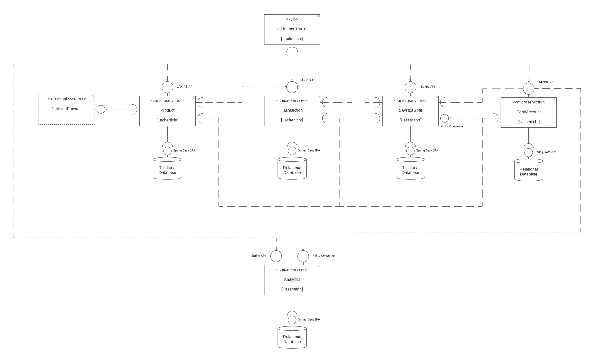

# Software Architecture [Lachenicht]

**<\<ui\>> UI-FinanceTracker**
Utilizes the REST APIs offered by microservies `BankAccount`, `Transaction`, `Product`, `SavingsGoal` and `Analytics` to offer system functionalities to a user.

**<\<microservice\>> BankAccount**
Provides a Spring REST API, which can be utilized to access functionalities of the domain BankAccount.
Sends Kafka messages to microservices `SavingsGoal` and `Analytics` on bank account updates.
Persists domain objects in a relational database using Spring Data JPA.

**<\<microservice\>> Transaction**
Provides a JAX-RS REST API, which can be utilized to access functionalities of the domain Transaction.
Requires the REST API offered by microservice `BankAccount` to transfer transactions on bank accounts.
Sends Kafka messages to microservice `Analytics` on transaction creation/update/deletion.
Persists domain objects in a relational database using Spring Data JPA.

**<\<microservice\>> Product**
Provides a JAX-RS REST API, which can be utilized to access functionalities of the domain Product.
Requires the REST API offered by microservice `Transaction` to transfer shopping expenses.
Sends Kafka messages to microservice `Analytics` on product update.
Persists domain objects in a relational database using Spring Data JPA.

**<\<externalsystem\>> NutritionProvider**
Provides an API, which can be utilizes to fetch nutrition values for products.

**<\<microservice\>> SavingsGoal**
Provides a Spring REST API, which can be utilized to access functionalities of the domain SavingsGoal.
Requires the REST API offered by microservice `Transaction` to transfer periodical savings goals.
Requires the REST API offered by microservice `BankAccount` to validate rule-based savings goals.
Consumes Kafka events sent by microservice `BankAccount` to re-validate rule-based savings goals on bank account update.
Sends Kafka messages to microservice `Analytics` on savings goal creation/update/deletion.
Persists domain objects in a relational database using Spring Data JPA.

**<\<microservice\>> Analytics**
Provides a Spring REST API, which can be utilized to access functionalities of the domain Analytics.
Consumes Kafka events sent by microservices `BankAccount`, `Transaction`, `Product` and `SavingsGoal` analyse spending und food consumption habits.
Persists domain objects in a relational database using Spring Data JPA.

**<\<database\>> Relational Database**
Offers a Spring Data JPA interface to persist data.